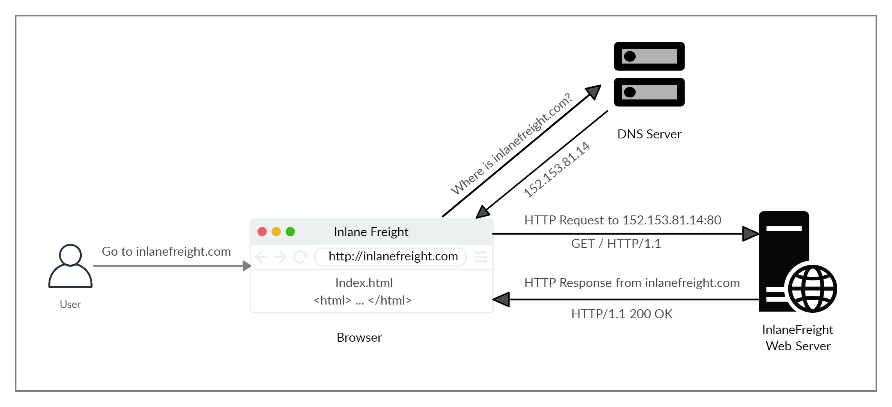

# HyperText Transfer Protocol (HTTP) Basics

- HTTP é um protocolo de nível de aplicativo usado para acessar recursos na World Wide Web. O termo hipertexto significa texto contendo links para outros recursos e textos que podem ser facilmente interpretados pelos leitores.

A comunicação HTTP consiste em um cliente e um servidor, onde o cliente solicita um recurso ao servidor. O servidor processa as solicitações e retorna o recurso solicitado. A porta padrão para comunicação HTTP é 80; no entanto, isso pode ser alterado.

Os recursos por HTTP são acessados por meio de um Localizador Uniforme de Recursos (URL). Vejamos a estrutura de um URL.

- Aqui está o que cada componente representa:

| Component      | Description                                                                                                                                                                                                                                                                                                                                      |
| -------------- | ------------------------------------------------------------------------------------------------------------------------------------------------------------------------------------------------------------------------------------------------------------------------------------------------------------------------------------------------ |
| `scheme`       | Isso é usado para identificar o protocolo que está sendo acessado pelo cliente. Geralmente é _http_ ou _https_.                                                                                                                                                                                                                                  |
| `User info`    | Este é um componente opcional que contém credenciais no formato _usuário:senha_, que é usado para autenticação no host.                                                                                                                                                                                                                          |
| `Host`         | O host significa a localização do recurso. Pode ser um nome de host ou um endereço IP. Dois pontos separam um **host** e uma **porta**.                                                                                                                                                                                                          |
| `Port`         | URLs sem uma porta especificada apontam para a porta 80 padrão. Se a porta do servidor HTTP não estiver sendo executada na porta 80, ela pode ser especificada na URL.                                                                                                                                                                           |
| `Path`         | PAth aponta para o recurso que está sendo acessado, que pode ser um arquivo ou uma pasta. Se nenhum caminho for especificado, o servidor retorna o documento de índice padrão hospedado por ele **(por exemplo, index.html)**.                                                                                                                   |
| `Query String` | A string de consulta é precedida por um ponto de interrogação (?). Este é outro componente opcional que é usado para passar informações para o recurso. Uma string de consulta consiste em um parâmetro e um valor. No exemplo acima, o parâmetro é _login_ e seu valor é _true_. Pode haver vários parâmetros separados por um E comercial (&). |
| `Fragment`     | Isso é processado por navegadores no lado do cliente para localizar seções dentro do recurso primário.                                                                                                                                                                                                                                           |

# HTTP Flow

