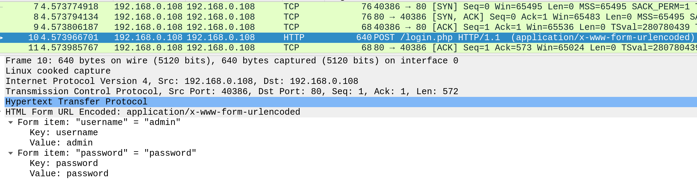
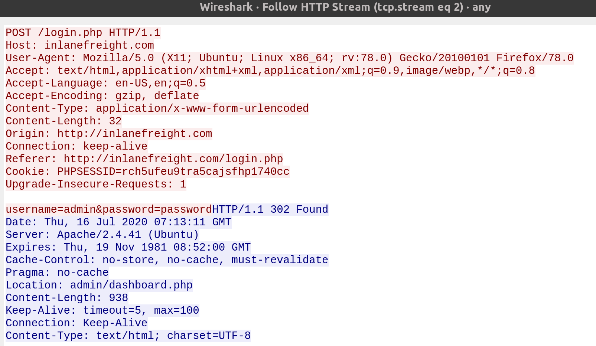
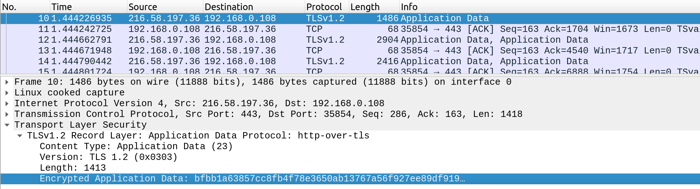
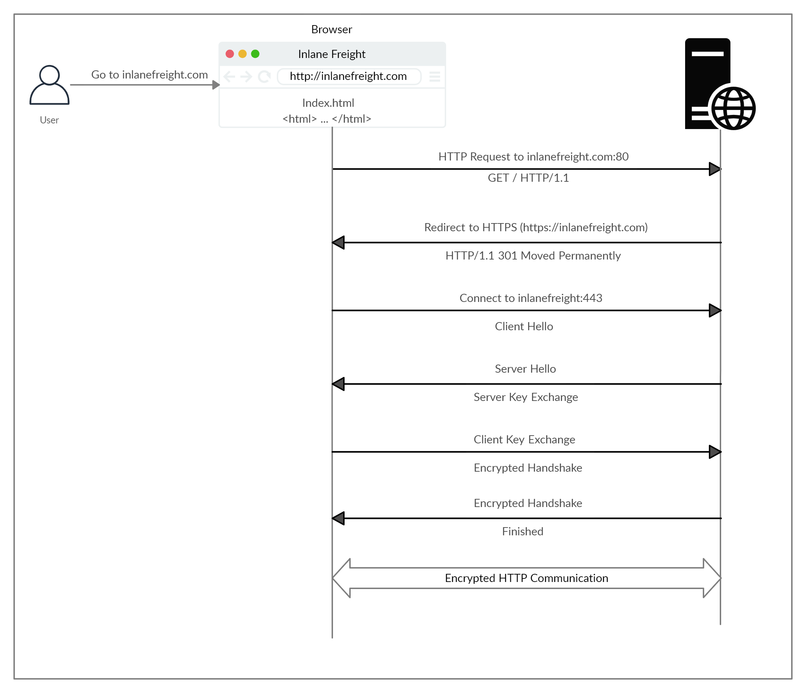

# Hypertext Transfer Protocol Secure (HTTPS)

- HTTPS Overview

Uma das principais desvantagens do HTTP é que todos os dados são transferidos em texto não criptografado, o que significa que qualquer pessoa entre a origem e o destino pode realizar um ataque man-in-the-middle (MiTM) para visualizar os dados transferidos. Este é um grande problema com sites bancários e governamentais, que contêm dados confidenciais do usuário.

Isso pode ser examinado usando um analisador de rede como o Wireshark. O exemplo a seguir demonstra o efeito de não impor comunicações seguras entre um navegador da web e um aplicativo da web. Se tentarmos fazer login em um site não seguro enquanto monitoramos o tráfego de rede usando um analisador gráfico de protocolo de rede de pacotes, como o Wireshark, podemos ver que as credenciais de login podem ser interceptadas em texto não criptografado. Isso tornaria mais fácil para alguém na mesma rede (como uma rede sem fio pública) capturá-los e usá-los para fins maliciosos.

Conforme visto a seguir, um invasor que captura o tráfego de rede seria capaz de visualizar toda a sequência de login, mostrando a solicitação de login (junto com o nome de usuário e a senha fornecidos) e o redirecionamento para uma página do painel administrativo após uma tentativa de login bem-sucedida.

Essas desvantagens deram origem ao protocolo HTTPS (HTTP Secure). Quando este protocolo está ativado, toda a comunicação entre o cliente (usuário acessando um aplicativo da web por meio de seu navegador) e o servidor da web que hospeda o aplicativo da web é criptografada. Quando o HTTPS é implementado em um aplicativo da web, torna-se impossível para qualquer pessoa interceptar e analisar o tráfego e capturar informações como credenciais e outros dados confidenciais.

A porta padrão para HTTPS é 443, que é preferida pelos navegadores em vez da porta HTTP 80, desde que não haja configurações incorretas que permitam ao usuário navegar em uma versão HTTP insegura de um site em vez da versão HTTPS. A execução do Wireshark durante a navegação em **https://google.com** mostra o tráfego que passa pela rede criptografado.

No exemplo acima, podemos ver que todo o tráfego ao navegar para **https://google.com** é criptografado.

---

## HTTPS Flow

Vejamos como o HTTPS opera em alto nível. Ao navegar para **http://inlanefreight.com**, o navegador tenta resolver o domínio e redireciona o usuário para o servidor que hospeda o site de destino. Uma solicitação é enviada para a porta 80 primeiro, que é o protocolo HTTP não criptografado. O servidor detecta isso e redireciona o cliente para a porta HTTPS 443 segura. Isso é feito por meio do código de resposta 301 Moved Permanently. Discutiremos os vários tipos de códigos de resposta retornados por um servidor HTTP posteriormente neste módulo.

Em seguida, o cliente (navegador da web) envia um pacote "alô do cliente", fornecendo informações sobre ele mesmo. Depois disso, o servidor responde com "server hello", seguido por uma troca de chaves. O cliente verifica essa chave e envia uma das suas. Depois disso, um handshake criptografado é iniciado para verificar se a criptografia e a transferência estão funcionando corretamente.

Depois que o handshake é concluído com êxito, a comunicação HTTP normal continua, que é criptografada depois disso. Esta é uma visão geral de alto nível da troca de chaves, que está além do escopo deste módulo.

Dependendo das circunstâncias, um invasor pode realizar um ataque de downgrade de HTTP, que reduz a comunicação HTTPS para HTTP. Isso é feito configurando um ataque man-in-the-middle (MITM) e fazendo proxy (passando) todo o tráfego através do host do invasor sem o conhecimento do usuário. Um ataque de downgrade bem-sucedido resultaria na transferência de dados HTTP em texto não criptografado, que o invasor pode registrar e posteriormente examinar ou manipular para fins maliciosos.
