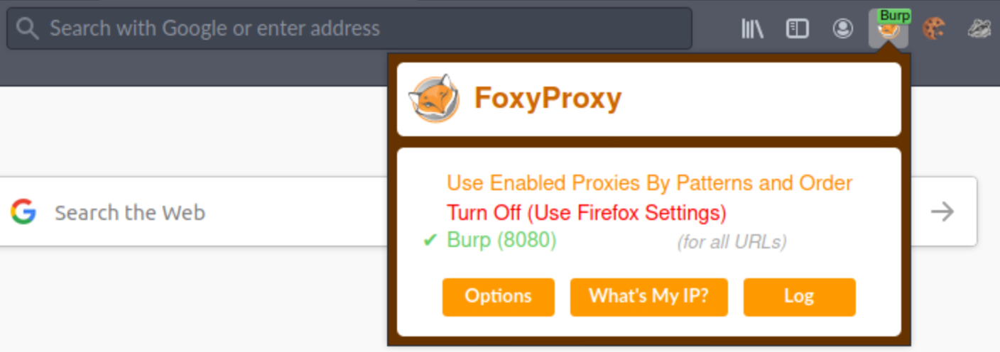
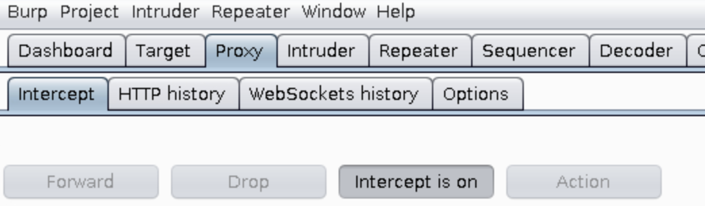
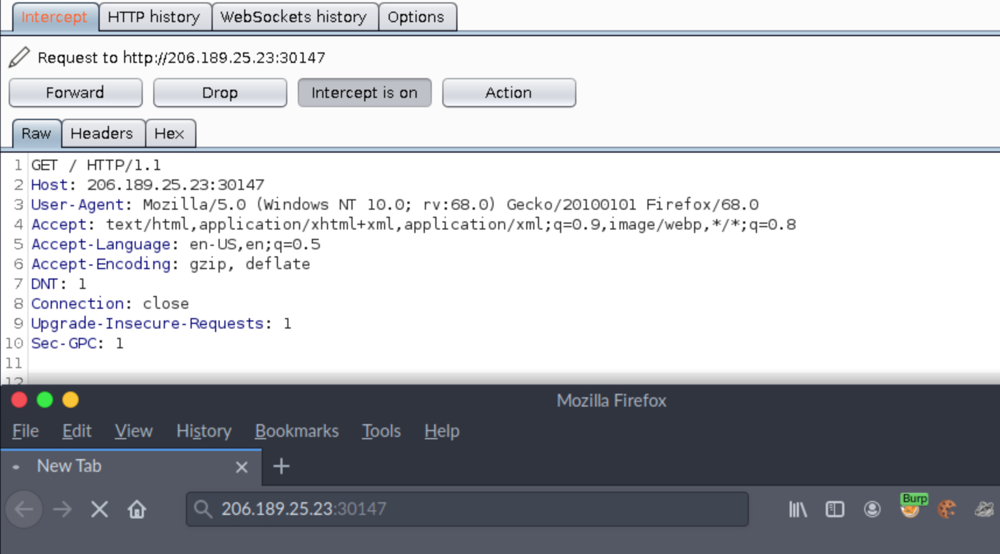
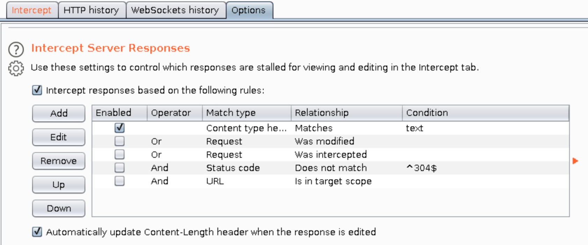
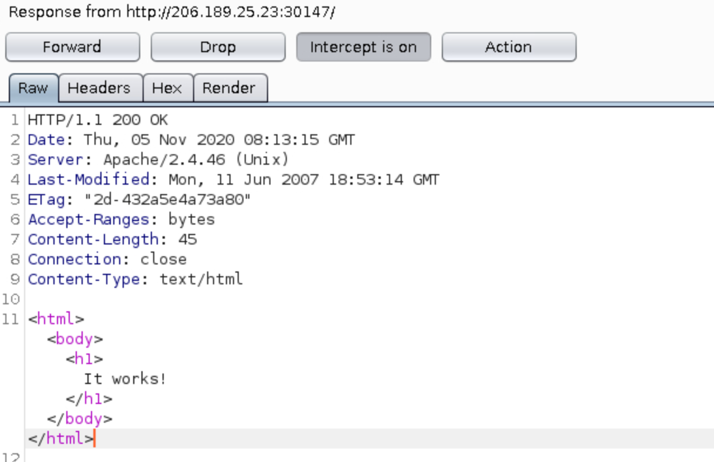
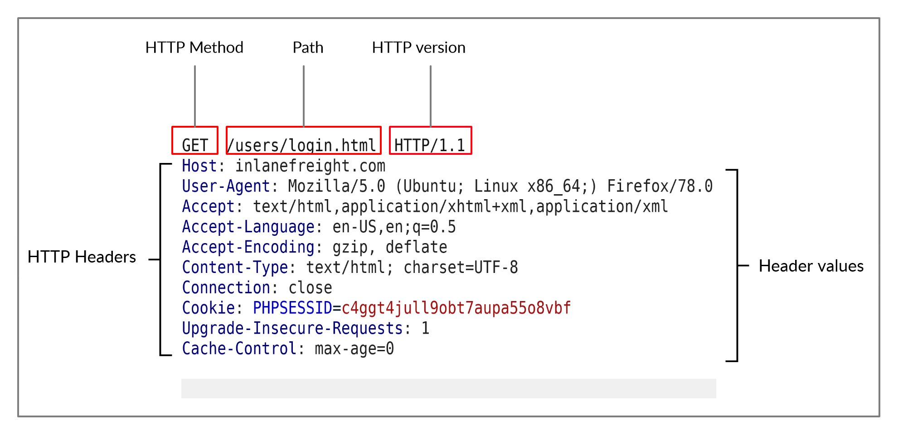
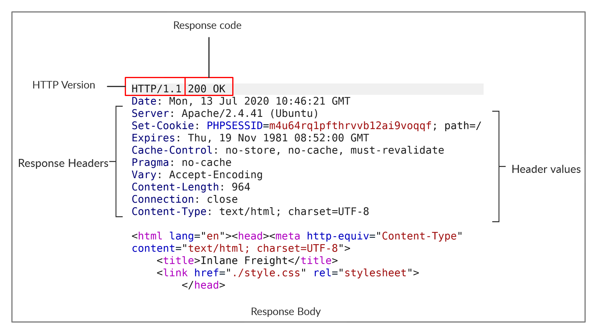

# Request and Response

> Note: You can follow along by spawning the target at the end of this section.

## Setting up Burp Suite

Antes de prosseguirmos, vamos ver como configurar o Burp Suite. Burp Suite é uma ferramenta que atua como um servidor proxy e pode ser usada para examinar e modificar solicitações HTTP. Ele fornece um proxy que pode rotear o tráfego do navegador através do proxy e visualizar as várias solicitações e respostas entre o cliente (navegador da web) e o servidor da web.

Close any of the prompts and then click on _Next > Start Project_. Now open _Firefox_ and click on the _FoxyProxy_ extension on the URL bar. Choose **Burp** from the list; this is the Burp proxy, which our requests will be routed through.

In Burp, click on the **Proxy** tab and ensure that the **Intercept is on** button is enabled. Click on **Forward** in case the request box is populated already until it's empty.

Switch to the browser and enter the target URL into the URL bar (http://206.189.25.23:30147 in this case).

After this, the request should be intercepted by Burp and appear as above. In order to intercept responses, click on **Options** and tick **Intercept Server responses**.

Now go back to the **Proxy** tab and click on **Forward** to forward the server's request.

This should present us with the server response, as shown above. Click on **Forward** to forward this to the browser.

---

## HTTP Request

- Vejamos uma solicitação HTTP bruta, conforme visto no Burp.

The image above shows an HTTP GET request to the URL:

`http://inlanefreight.com/users/login.html`

A primeira linha de uma solicitação HTTP contém três campos separados por espaços.

| Campo     | Description                                                                                                                         |
| --------- | ----------------------------------------------------------------------------------------------------------------------------------- |
| `Method`  | O primeiro campo representa o método ou verbo HTTP, que especifica o tipo de ação a ser executada.                                  |
| `Path`    | O segundo campo é o caminho para o recurso que está sendo acessado. Este campo também pode ser sufixado com uma string de consulta. |
| `Version` | O terceiro e último campo é usado para denotar a versão HTTP.                                                                       |

- The next set of lines contain HTTP header value pairs. These are used to specify various attributes of a request. The headers are terminated with a new line, which is necessary for the server to validate the request. This can be followed by the request body,

## HTTP Response

- A seguir, vamos examinar uma resposta HTTP bruta.

Semelhante à _Request_, uma **resposta HTTP** também contém cabeçalhos. A primeira linha contém dois campos separados por espaços. O primeiro é a versão HTTP, enquanto o segundo denota o código de resposta HTTP. Os códigos de resposta são usados para determinar se uma solicitação foi bem-sucedida ou não. O corpo da resposta está presente após os cabeçalhos, separados por uma nova linha. O corpo da resposta geralmente é definido como código HTML. No entanto, ele também pode responder com outros tipos de código, como JSON, recursos do site, como imagens, folhas de estilo ou scripts, ou mesmo um documento como um documento PDF hospedado no servidor da web.
